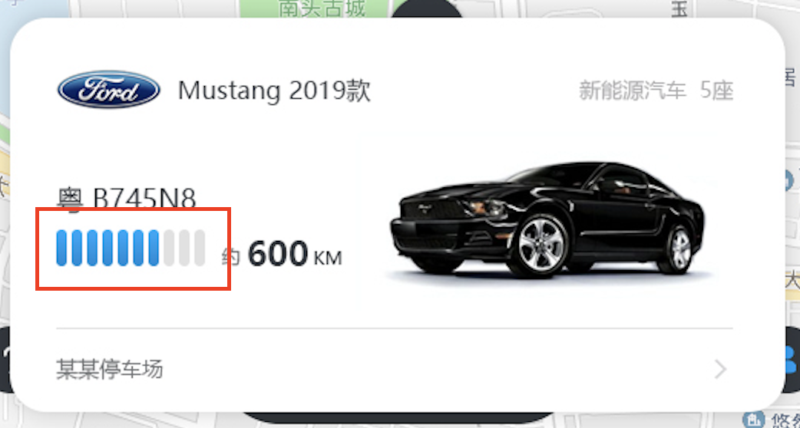
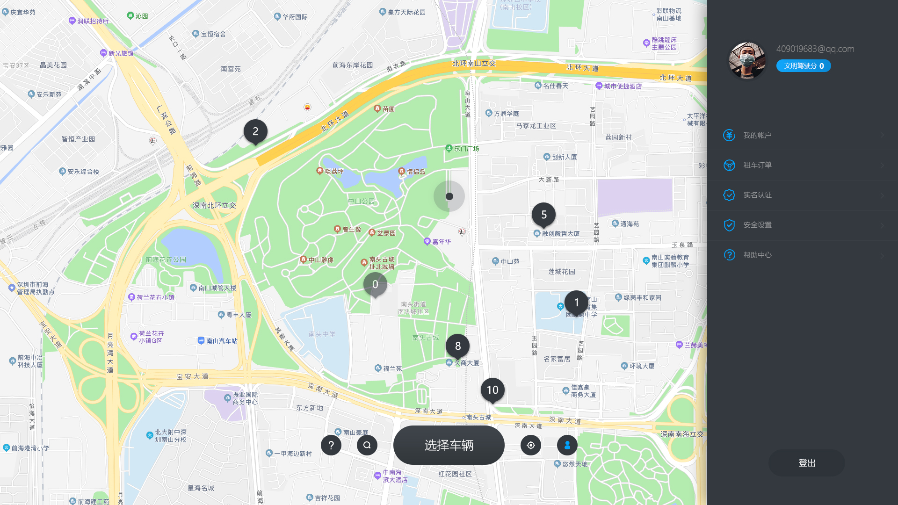

# Vue2.0项目-在线租车_管理系统

> 本项目为后台管理系统部分，客户端部分详见 👉 [vue-cars](https://github.com/MrEnvision/vue-cars)

教程官网：http://www.web-jshtml.cn/#/   视频地址：https://www.bilibili.com/video/BV1Gz411z75G

**学习内容**：头脑风暴分析项目，项目功能延伸思维，程序逻辑分析；高德地图基础级API学习；Vue+Vuex+Router+ElementUi+Webpack全家桶，ElementUI组件，VUE各项指令，component、props、propsData、computed，watch，组件化开发，生命周期，路由权限，Sass，Axios拦截器，缓存，项目部署，Nginx，域名，服务器，GIT，原型，接口联调，性能，缓存，检测toKen等；

**学习成效**：掌握对项目的扩展延伸思维，项目在业务上的关联性。完全自主搭建后台管理系统，高德地图API应用；


## 第1-11课时

主要为项目开发流程介绍，包含需求文档、功能分析、原型绘制、测试用例等内容。

## 第12课时

### 12.1 高德地图组件

>[vue-amap](https://elemefe.github.io/vue-amap)是基于 Vue 2.x 与[高德地图](https://lbs.amap.com/api/javascript-api/example)的组件。

```shell
npm install vue-amap --save
```

引入vue-amap

```js
// main.js
import Vue from 'vue';
import VueAMap from 'vue-amap';
import App from './App.vue';

Vue.use(VueAMap);
VueAMap.initAMapApiLoader({
  key: 'your amap key', // 官网申请
  plugin: ['AMap.Autocomplete', 'AMap.PlaceSearch', 'AMap.Scale', 'AMap.OverView', 'AMap.ToolBar', 'AMap.MapType', 'AMap.PolyEditor', 'AMap.CircleEditor'], // 插件（按需引入）
  v: '1.4.4' // 高德 sdk 版本
});

new Vue({
  el: '#app',
  render: h => h(App)
})
```

使用vue-amap

```vue
// APP.vue
<template>
  <div id="app">
    <h3 class="title">{{ msg }}</h3>
    <div class="amap-wrapper">
      <el-amap class="amap-box" :vid="'amap-vue'"></el-amap>
    </div>
  </div>
</template>

<script>
export default {
  data () {
    return {
      msg: 'vue-amap向你问好！'
    }
  }
}
</script>

<style>
.amap-wrapper {
  width: 500px;
  height: 500px;
}
</style>
```

## 第13课时

### 13.1 兼容高德地图SDK

在定制化程度较高的项目中，开发者可能只想通过 vue-amap 引入高德地图，而部分实例化的操作直接基于高德地图的 sdk 完成。这个时候就需要 `lazyAMapApiLoaderInstance`。

```vue
<template>
  <div class="amap-wrapper">
    <el-amap :vid="'amapVue'" :center="center" :zoom="zoom"></el-amap>
  </div>
</template>

<script>
import { lazyAMapApiLoaderInstance } from "vue-amap";

export default {
  name: "Index",
  data() {
    return {
      map: null,
      zoom: 13,
      center: [116.404765, 39.918052]
    };
  },
  mounted() {
    lazyAMapApiLoaderInstance.load().then(() => {
      // eslint-disable-next-line no-undef
      this.map = new AMap.Map("amapVue", {
        center: this.center,
        zoom: this.zoom
      });
    });
  }
};
</script>

<style lang="scss" scoped>
.amap-wrapper {
  width: 100vw;
  height: 100vh;
}
</style>
```

## 第14课时

### 14.1 SCSS清除浮动

```scss
@mixin clearfix {
  &:after {
    clear: both;
    content: '.';
    display: block;
    height: 0;
    line-height: 0;
    overflow: hidden;
  }
  *height: 1%; // 貌似兼容IE7的意思？
}
```

```scss
.wrap {
  @include clearfix; // 使用方法
}
```

### 14.2 SCSS生成通用CSS



如上图所示的需求，会显示一格电至十格电，这个时候就可以设置一些的通用的css样式，例如active-1代表前1个格子为蓝色，active-4代表前4个格子为蓝色，这时候我们就需要利用SCSS利用代码的思维来生成10个active-i，而不是我们自己手动重复写10个css样式。

**css选择器小知识**：

> 尤其要注意:nth-child(-n+length)代表前length个元素！！！

```
:nth-child() 代表选择某个的一个或多个特定的子元素
1、:nth-child(number);/*参数是具体数字*/ 
2、:nth-child(n);/*参数是n,n从0开始计算*/ 
3、:nth-child(n*length)/*n的倍数选择，n从0开始算*/ 
4、:nth-child(n+length);/*选择大于length后面的元素*/ 
5、:nth-child(-n+length)/*选择小于length前面的元素*/ 
6、:nth-child(n*length+1);/*表示隔几选一*/ 
```

需求实现代码：

```scss
@for $i from 1 through 10 {
  .active-li-#{$i} {
    li:nth-child(-n + #{$i}) {
      // ...
    }      
  }
}
```

## 第15课时

### 15.1 swiper滑动功能

[Swiper](https://swiperjs.com/vue/)是纯javascript打造的滑动特效插件，swiper6.0目前仅支持vue3.0，Vue2.0可以结合[vue-awesome-swiper](https://github.com/surmon-china/vue-awesome-swiper)。

```
npm install swiper vue-awesome-swiper --save
```

具体使用详见官方文档API

## 第16课时

略。

## 第17课时

### 17.1 弹窗鼠标点击事件

需求描述：点击user icon则右侧滑动出现，点击其他区域则右侧滑动消失。



实现方案：在页面挂载一个mouseup监听函数，当右侧栏显示的时候，点击鼠标时判断鼠标点击的位置是否是右侧栏的区域（通过document.getElementById等方法获取），如果不是则更新使右侧滑动消失，反之，则不处理。

```js
mounted() {
  document.addEventListener("mouseup", e => {
    const sider = document.getElementById("sider-wrap");
    if (sider && sider.contains(e.target)) {
      this.$router.push({ name: "Home" });
    }
  });
}
```

## 第18课时

### 18.1 全局组件

> 全局注册后即可直接使用，`<MyComponent></MyComponent>`

```js
import MyComponent from '@/components/MyComponent.vue'
Vue.component("MyComponent", MyComponent); // 全局自定义组件
```

## 第19课时

> 完成后台管理系统登录/注册功能，注意跨域访问、请求拦截器、路由守卫、验证码流程等相关内容可详见[vue3.0后台管理系统项目实战](https://github.com/MrEnvision/vue-admin)，本项目仅简单实现。

略。

## 第20课时

### 20.1 修饰符sync

父组件向子组件传数据的时候，这是一个单向数据流，当我们在子组件中想要修改通过props绑定的父组件里的数据时，Vue不支持我们直接在子组件中进行修改，子组件没有修改父组件数据的权力，其中一种方法就是通过修饰符`.sync`

```vue
// 父组件
<template>
	<!-- 完整写法 <Child :number="total" @update:number="total = $event"/> -->
	<Child :number.sync="total"></Child>
</template>
<script>
  import Child from 'components/Child.vue'
  export default {
    name: 'Parent',
    components: {
      Child
    }
    data() {
      return {
        total: 1000
      }
    }
  }
</script>
```

```vue
// 子组件
<template>
	{{number}}
	<button @click="change" >change</button>
</template>
<script>
  export default {
    name: 'Child',
    props: {
      number: {
        type: Number,
        default: 0
      }
    },
    methods:{
      change() {
        this.$emit('update:number',this.number + 1)
      }
    }
  }
</script>
```

## 第21课时

略。

## 第22课时

### 22.1 富文本编辑器

```
npm i wangeditor --save
```

本文中使用[wangEditor](http://www.wangeditor.com)富文本编辑器插件，具体使用详见[说明文档](http://www.wangeditor.com/doc/)。

```vue
<template>
  <div class="home">
    <h3>wangEditor with vue</h3>
    <div id="demo1"></div>
    <button type="button" class="btn" @click="getEditorData">获取当前内容</button>
    <h3>内容预览</h3>
    <textarea name="" id="" cols="170" rows="20" readonly v-model="editorData"></textarea>
  </div>
</template>

<script>
// 引入 wangEditor
import wangEditor from 'wangeditor'
export default {
  data() {
    return {
      editor: null,
      editorData: ''
    }
  },
  mounted() {
    const editor = new wangEditor(`#demo1`)
    // 配置 onchange 回调函数，将数据同步到 vue 中
    editor.config.onchange = (newHtml) => {
       this.editorData = newHtml
    }
    // 创建编辑器
    editor.create()
    this.editor = editor
  },
  methods: {
    getEditorData() {
      // 通过代码获取编辑器内容
      let data = this.editor.txt.html()
      alert(data)
    }
  },
  beforeDestroy() {
    // 调用销毁 API 对当前编辑器实例进行销毁
    this.editor.destroy()
    this.editor = null
  }
}
</script>

<style lang="scss">
  .home {
    width: 1200px;
    margin: auto;
    position: relative;
    .btn {
      position: absolute;
      right: 0;
      top: 0;
      padding: 5px 10px;
      cursor: pointer;
    }
    h3 {
      margin: 30px 0 15px;
    }
  }
</style>
```

## 第23课时

略。

## 第24课时

### 24.1 JSON配置写法

传统的一些写法就是根据`if`来不断判断条件进行设置：

```js
// 省
if (level === 0) {
  requestData.type = "province";
}
// 市
if (level === 1) {
  requestData.type = "city";
  requestData.province_code = node.value;
}
// 区
if (level === 2) {
  requestData.type = "area";
  requestData.city_code = node.value;
}
```

我们其实可以根据JSON配置来简化上述代码，这样更加利于配置：

```js
const config = {
  0: {
    type: "province"
  },
  1: {
    type: "city",
    code: "province"
  },
  2: {
    type: "area",
    code: "city"
  }
};
requestData.type = config[level].type;
if (config[level].code) {
  requestData[`${config[level].code}_code`] = node.value;
}
```

这个方法很实用，也很方便，要掌握哦！！！

## 第25课时

### 25.1 组件回调小技巧

如下所示，组件回调的常规做法设置一堆对应的函数来进行调用。

```vue
<template>
	<myComponent @a="functionA" @b="functionB" @c="functionC"></myComponent>
</template>
```

其实可以做一个简化的操作，通过返回一个JSON包括函数名和执行参数来处理

```vue
<template>
	<myComponent @callback="callback"></myComponent>
</template>
<script>
  export default {
    methods: {
      callback(params) {
        if (params.funcName) {
        	this[params.funcName](params.data)
      	}
      }
    }
  }
</script>
```

```js
this.$emit("callback", {
	funcName: a,
	data: {}
})
```

## 第26课时

略。

## 第27课时

### 27.1 数据统一配置

在多处使用的内容，可以抽离出来统一定义，避免了修改时需要修改多处的情况，例如本项目中停车场类型有室内室外，表单和列表中多个地方需要显示和选择，则可以在一个地方统一管理这些数据。可通过两种方法来管理：一种是通过Vuex来管理，就仅使用Vuex的state属性，然后全局引入即可使用；第二种是建立一个JS文件，在使用的地方引入即可。（也许更建议使用Vuex来管理吧？）

## 第28课时

### 28.1 nextTick方法

Vue 实现响应式并不是数据发生变化之后 DOM 立即变化，而是按一定的策略进行 DOM 的更新。$nextTick 是在下次 DOM 更新结束之后执行延迟回调，在修改数据之后使用 $nextTick，则可以在回调中获取更新后的 DOM。当项目中你想在改变DOM元素的数据后基于新的dom做点什么，对新DOM一系列的js操作都需要放进Vue.nextTick()的回调函数中。

> 注意，Vue生命周期的created()钩子函数进行的DOM操作一定要放在Vue.nextTick()的回调函数中，原因是在created()钩子函数执行的时候DOM 其实并未进行任何渲染，而此时进行DOM操作无异于徒劳，所以此处一定要将DOM操作的js代码放进Vue.nextTick()的回调函数中。

```vue
<script>
  export default {
    methods: {
      myfunc(){
        this.$nextTick(()=>{
          // ....
        })
      }
    }
  }
</script>
```

